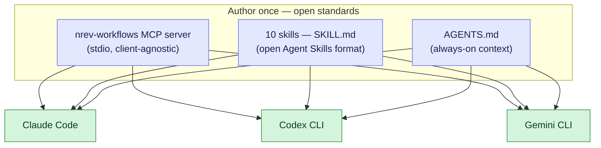
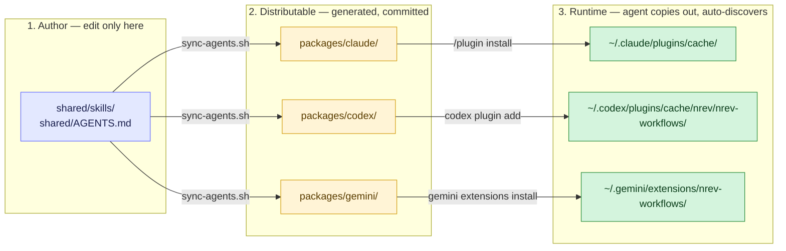

# Multi-Agent Packaging

How this repo ships one MCP server and one set of skills to **Claude Code,
Codex CLI, and Gemini CLI** from a single source, and how to maintain and extend
that. This is the maintainer's guide; the design rationale (options weighed,
decision record) lives in the `documentations` repo at
`nrev-mcp/multi-agent-support.md`.

---

## TL;DR

- **Edit only `shared/`** (`shared/skills/` + `shared/AGENTS.md`).
- Run **`scripts/sync-agents.sh`** to regenerate every agent package.
- Commit. The generated `packages/{claude,codex,gemini}/` are committed too —
  installers fetch them from the repo.
- Never hand-edit `skills/` or `mcp/` inside a package; they are generated.

```
shared/*  --edit-->  scripts/sync-agents.sh  --build-->  packages/{claude,codex,gemini}/  --commit-->  installers
```

---

## Why it's built this way

Two facts make one source serve every agent:

1. **The MCP server speaks stdio** (`FastMCP.run()` in
   [`servers/workflows/.../server.py`](../servers/workflows/src/nrev_workflows_mcp/server.py)) —
   the universal MCP transport. Every agent launches it with the same
   `uv run … nrev-workflows-mcp` command, and receives the server's
   `INSTRUCTIONS` over the MCP `initialize` handshake for free.
2. **Skills are the open Agent Skills format** (`SKILL.md` with
   `name`/`description` frontmatter + progressive disclosure), which Claude
   Code, Codex, and Gemini all read **without modification**.

So content is authored once and never forked. Only three thin, mechanical things
differ per agent — none of them content:



| Concern | Claude Code | Codex CLI | Gemini CLI |
|---|---|---|---|
| User skills path | `~/.claude/skills/` | `~/.agents/skills/` | `~/.gemini/skills/` |
| Always-on file | `CLAUDE.md` | `AGENTS.md` | `GEMINI.md` (configurable) |
| MCP config | `.mcp.json` (JSON) | plugin `.mcp.json` / `~/.codex/config.toml` | `settings.json` / extension (JSON) |
| Package unit | plugin + marketplace | plugin + marketplace | extension |

---

## The three hops

`packages/<agent>/` is **never read at runtime**. It is the *distributable*
source an install command points at; on install the agent **copies** it into its
own runtime location and auto-discovers `skills/` + the MCP server by folder
structure.



| Agent | What references the package (hop 2→3) | Copied to (runtime) | Loads by |
|---|---|---|---|
| Claude | `marketplace.json` → `source: ./packages/claude` | `~/.claude/plugins/cache/` | auto-discover `skills/` + `.mcp.json` |
| Codex | `.agents/plugins/marketplace.json` → `source: ./packages/codex` | `~/.codex/plugins/cache/nrev/nrev-workflows/<version>/` | manifest `skills` + `mcpServers` (`.mcp.json`) |
| Gemini | `gemini extensions install ./packages/gemini` | `~/.gemini/extensions/nrev-workflows/` | manifest `mcpServers` + auto-discover `skills/` |

---

## Repository layout

```
shared/                    # ⭐ SINGLE SOURCE OF TRUTH — hand-edited
  skills/                  #   10 SKILL.md domain skills (open format)
  AGENTS.md                #   always-on context (thin; server ships INSTRUCTIONS)

packages/                  # one uniform package per agent — COMMITTED
  claude/                  #   Claude Code plugin
    .claude-plugin/        #     plugin.json          (hand-authored)
    .mcp.json              #     stdio launch config  (hand-authored)
    bin/                   #     run-mcp.sh, login.sh (hand-authored, Unix dev)
    skills/                #     ← generated from shared/skills
    mcp/                   #     ← generated: bundled server
  codex/                   #   Codex plugin
    .codex-plugin/         #     plugin.json               (hand-authored)
    .mcp.json              #     MCP declaration, relative + cwd (hand-authored)
    bin/                   #     run-mcp.sh launcher       (hand-authored, Unix)
    config.toml            #     manual (no-plugin) MCP block (hand-authored)
    AGENTS.md              #     ← generated from shared/AGENTS.md
    skills/  mcp/          #     ← generated
  gemini/                  #   Gemini CLI extension
    gemini-extension.json  #     extension manifest        (hand-authored)
    GEMINI.md              #     ← generated from shared/AGENTS.md
    skills/  mcp/          #     ← generated

servers/workflows/         # the MCP server (source of truth for the server)
scripts/
  sync-agents.sh           # fan shared/ + server → all packages
  bump-version.sh          # stamp every version field in lockstep
.claude-plugin/
  marketplace.json         # Claude marketplace catalog (source: ./packages/claude)
.agents/plugins/
  marketplace.json         # Codex marketplace catalog  (source: ./packages/codex)
```

**Generated vs hand-authored inside a package:** `skills/`, `mcp/`, and the
context file (`AGENTS.md`/`GEMINI.md`) are generated by `sync-agents.sh`. The
manifest (`.claude-plugin/` / `.codex-plugin/` + `.mcp.json` / `config.toml` /
`gemini-extension.json`) and `bin/` are hand-authored. Both are committed — the
generated parts because installers fetch them from git, not from a build step.

---

## The golden rule

**Edit `shared/`, then run the sync. Never hand-edit generated files.**

A change to a skill or the shared context is one edit in `shared/` followed by
`scripts/sync-agents.sh`. If you edit `packages/*/skills/` directly, the next
sync silently overwrites it. This is the same discipline the repo already
applies to the bundled server (`servers/workflows` is canonical; each
`packages/*/mcp/` is a generated copy).

---

## `scripts/sync-agents.sh`

```
scripts/sync-agents.sh              # --build (default): regenerate every package
scripts/sync-agents.sh --build
scripts/sync-agents.sh --link-dev   # dev loop: symlink shared/skills into the
                                     # live user skills dirs of all three agents
```

- **`--build`** — for each of `claude`, `codex`, `gemini`: replace
  `packages/<agent>/skills/` from `shared/skills/`, and re-bundle the server into
  `packages/<agent>/mcp/`. Then copy `shared/AGENTS.md` to Codex's `AGENTS.md`
  and Gemini's `GEMINI.md` (Claude relies on the server `INSTRUCTIONS` + skills,
  so it ships no context file). Idempotent — re-running produces no diff.
- **`--link-dev`** — symlinks each skill dir into `~/.claude/skills`,
  `~/.agents/skills`, and `~/.gemini/skills` so local edits under `shared/` are
  picked up without a rebuild. Per-skill symlinks, so an existing skills dir is
  never clobbered. Does not touch `packages/`.

---

## Per-agent packages

### Claude Code — `packages/claude/`

Installed via the marketplace (`nrev-workflows@nrev`); `marketplace.json`'s
`source` points at `./packages/claude`. `.mcp.json` launches the bundled server
with `uv run --project ${CLAUDE_PLUGIN_ROOT}/mcp nrev-workflows-mcp`. On install,
Claude copies the package into `~/.claude/plugins/cache/` and auto-discovers
`skills/` + `.mcp.json`. See [repo README](../README.md) for install steps.

### Codex CLI / Codex app — `packages/codex/`

Installed as a native Codex plugin (Codex ≥ 0.117). The repo-root
`.agents/plugins/marketplace.json` points at `./packages/codex`;
`.codex-plugin/plugin.json` declares `skills` and `mcpServers` (→ `.mcp.json`,
which launches `bin/run-mcp.sh` via a relative path + `cwd`). Install:

```
codex plugin marketplace add https://github.com/nurturev/nrev-mcp.git
codex plugin add nrev-workflows@nrev
```

Manual (no-plugin) fallback: copy `skills/` into `~/.agents/skills/` and add
the `config.toml` block to `~/.codex/config.toml`. See
[`packages/codex/README.md`](../packages/codex/README.md).

### Gemini CLI — `packages/gemini/`

`gemini extensions install ./packages/gemini` copies the extension into
`~/.gemini/extensions/nrev-workflows/`; the `gemini-extension.json` manifest
declares `mcpServers` and `contextFileName`, and `skills/` is auto-discovered.
See [`packages/gemini/README.md`](../packages/gemini/README.md).

---

## Versioning & releases

`scripts/bump-version.sh MAJOR.MINOR.PATCH` stamps every version field in
lockstep and re-syncs all packages:

- `packages/claude/.claude-plugin/plugin.json` — **authoritative** for Claude
  Code `/plugin update` (semver compare; wins over the marketplace entry).
- `.claude-plugin/marketplace.json` — catalog entry.
- `servers/workflows/pyproject.toml` — the MCP package version.
- `packages/codex/.codex-plugin/plugin.json`, `packages/gemini/gemini-extension.json`.
- Each `packages/*/mcp/pyproject.toml` — propagated by the re-sync.

Then update `CHANGELOG.md`, commit, and `git tag vX.Y.Z`. Never hand-edit one
version field alone — divergence is silent.

---

## Adding a new agent

1. Create `packages/<agent>/` with its hand-authored manifest (whatever that
   agent's native package format is) and a short `README.md`.
2. In `scripts/sync-agents.sh`, add `<agent>` to the `build()` loop so it gets
   `skills/` + `mcp/`, and add its context-file copy if the agent reads one
   (map `shared/AGENTS.md` to the agent's expected filename).
3. In `scripts/bump-version.sh`, add the new manifest to the version-stamp list.
4. Document install steps in `packages/<agent>/README.md` and add a bullet to
   the README's "Multi-agent support" section.
5. Run `scripts/sync-agents.sh --build` and verify the skills match
   `shared/skills/`.

Because skills and the server are the open, shared parts, a new agent is a new
manifest + a loop entry — never a content rewrite.

---

## Existing Claude users — migration safety

The Claude plugin was relocated `plugins/nrev-workflows/ → packages/claude/`
(history-preserving `git mv`). This is a **relocation, not a format change**, and
is safe because what identifies an install is untouched:

- **Install identity** `nrev-workflows@nrev` (plugin name + marketplace name) is
  unchanged; only the marketplace `source` path moved.
- **Running installs** in `~/.claude/plugins/cache/` keep working; on the next
  `/plugin update` they re-copy from `packages/claude/`, invisibly, because the
  format and content are identical.
- **Auth** (`~/.nrev-workflows/credentials`) is independent — users stay signed in.

---

## How Codex launches the MCP server (verified)

Verified against the `openai/codex` source and a live install:

- **MCP servers are NOT sandboxed.** Codex spawns them as plain child
  processes with full network and filesystem access; the seatbelt/landlock
  sandbox applies only to shell commands the model runs. A first-launch
  `uv run` that cold-resolves dependencies is fine — its only budget is
  `startup_timeout_sec` (30s default in current builds; older builds and the
  published docs say 10s — we set it explicitly).
- **The environment is stripped.** Only PATH, HOME, and a small whitelist are
  forwarded to the server. Anything else (e.g. `NREV_ENV`) must be passed via
  the server's `env` map. The desktop app's own PATH may lack uv's install
  dir, which is why `bin/run-mcp.sh` prepends the common uv locations.
- **No `${…}` variable expansion in MCP configs.** Codex also reads
  Claude-format plugins (`.claude-plugin/marketplace.json` + `.mcp.json`) for
  compatibility, but does not expand `${CLAUDE_PLUGIN_ROOT}` — which is how
  the first Codex install of this repo broke: with no Codex manifest present,
  Codex consumed `packages/claude/` and ran
  `uv run --project '${CLAUDE_PLUGIN_ROOT}/mcp'` literally, so the server died
  at spawn and the agent fell back to hand-running the bundled code. Native
  Codex plugins use **relative paths + `cwd`** resolved against the plugin
  root instead — that is what `packages/codex/.mcp.json` does, and why the
  repo now carries a native `.agents/plugins/marketplace.json`.

**Cowork cloud / claude.ai** connect from Anthropic's cloud, so a local stdio
server doesn't apply there — the durable fix is a **remote Streamable HTTP MCP
server** (roadmap; the transport is isolated in `app.py`/`transport.py`, so
it's additive). That also covers zero-install customer distribution.

## Open items (need a live smoke test before external distribution)

Verified: the stdio server + skills load in any MCP/Skills-capable agent, and
the **Codex plugin path is smoke-tested end to end** against a live install
(Codex 0.142): `codex plugin marketplace add` reads
`.agents/plugins/marketplace.json` (which takes precedence over the legacy
`.claude-plugin/` manifest), `codex plugin add` installs `packages/codex/`, and
the `.mcp.json`-declared server registers with the plugin root as `cwd` and
completes the MCP handshake in ~2s. One packaging detail remains best-effort
and is flagged in the package README:

- **Gemini extension install** — `gemini extensions install <git-url>` has
  historically expected the manifest at repo root; a monorepo subdir may need
  the local-path form, a `--ref`/path flag, or a small satellite repo. The
  `${extensionPath}` MCP path variable also needs confirming.

The Gemini fallback (manual skills copy + `settings.json`) is
guaranteed-working, so it doesn't block "runs in Gemini" — it only gates the
one-command extension install.

---

## Related

- Design rationale / decision record: `documentations` repo →
  `nrev-mcp/multi-agent-support.md`
- [Repo README](../README.md) — install steps and tool surface
- [`packages/codex/README.md`](../packages/codex/README.md),
  [`packages/gemini/README.md`](../packages/gemini/README.md)
